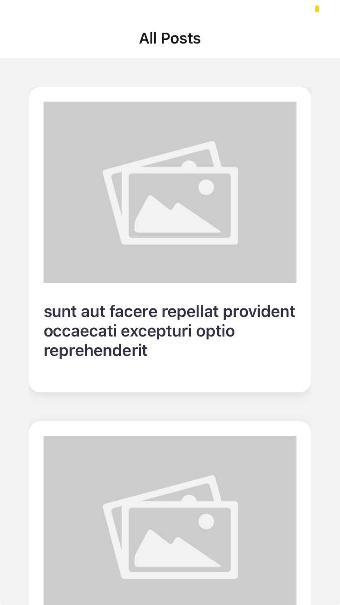
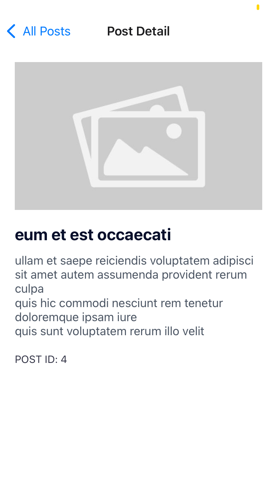

# React Native Post Listing App

This is a simple post listing application made with react native. 
It uses [JSONPlaceholder API](https://jsonplaceholder.typicode.com/) for fetching posts and displays them as a list. When a post is tapped, post details page is opened.

## Features

- Fetches posts from JSONPlaceholder
- Displays posts in post list screen
- Navigates to post detail screen on on post click

## Tech Stack

- React Native
- TypeScript
- Axios
- Expo Router (for navigation)

## Getting Started

### 1. Clone the Repository

```bash
git clone https://github.com/BatraAayush/post-list-react-native.git
cd post-listing-app
npm install
npm run start
```

## Screenshots
### Post List



### Post Details


